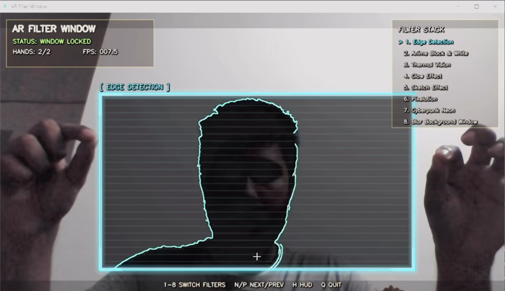
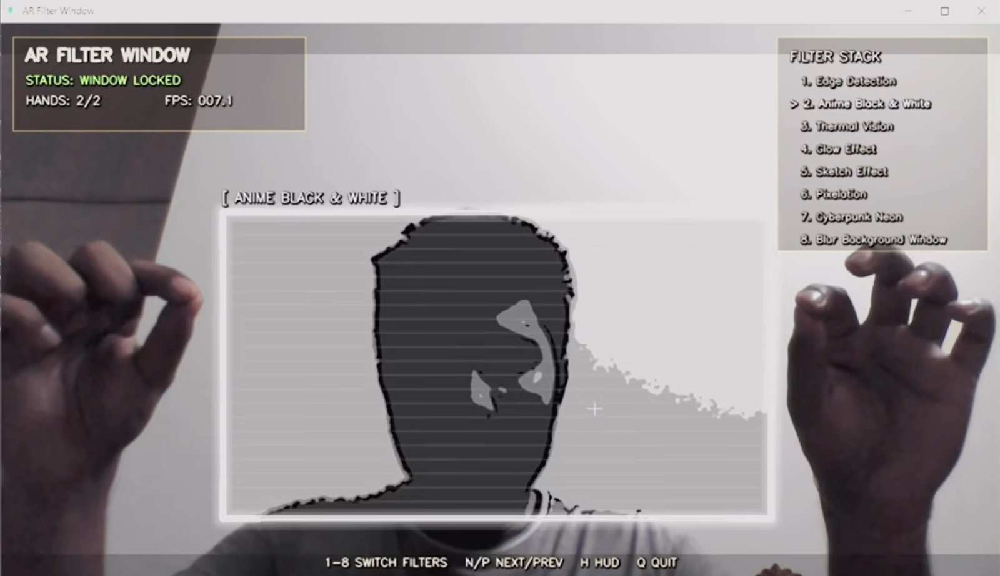
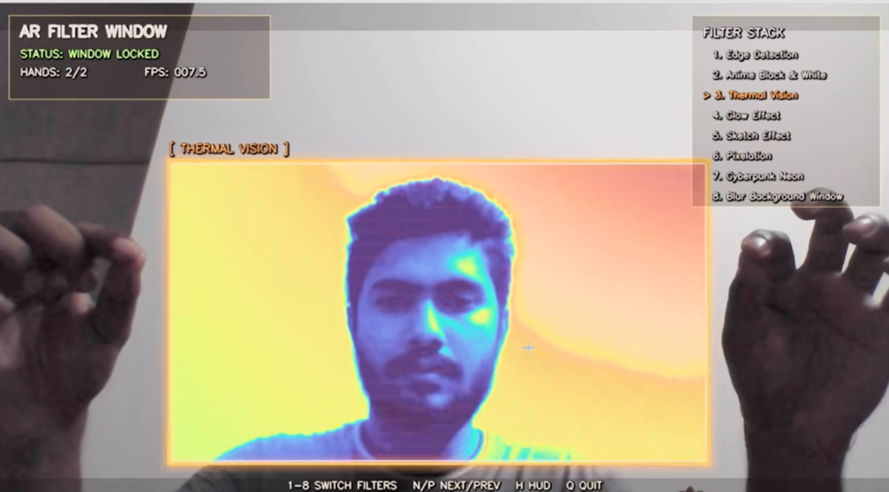
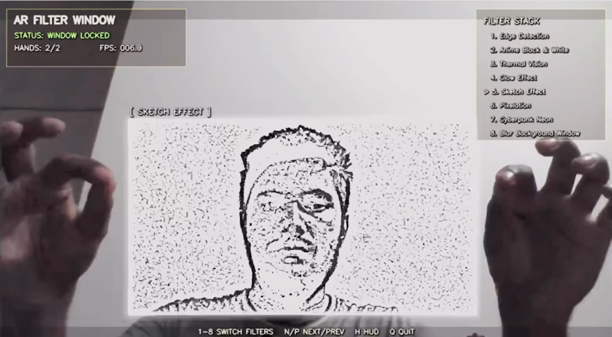
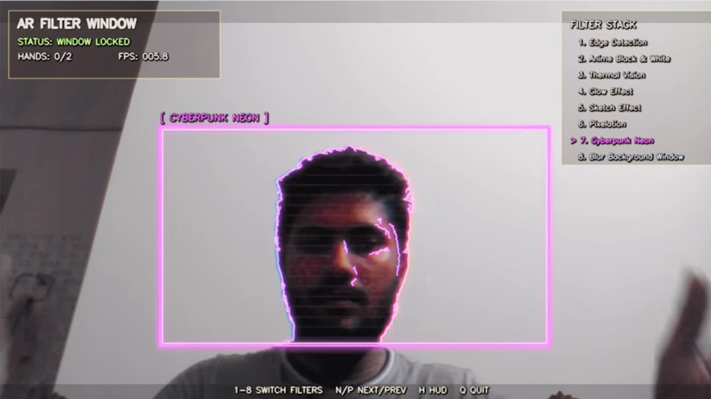

# PrismAR

PrismAR, also known as AR Filter Window, is a real-time computer vision and augmented reality project built with Python, OpenCV, MediaPipe, and NumPy. It uses a webcam to detect both of the user's hands, creates a dynamic floating window between them, and applies cinematic visual effects only inside that selected region.

The result feels like an interactive AR display: the user's hands act as physical anchors, the rectangle resizes as the hands move, and the selected filter updates live while the rest of the camera feed remains unchanged.

No model training, GPU, or datasets are required. If your MediaPipe install uses the newer Tasks API, the pretrained hand model is downloaded once during setup or first run.

> **Note:** newer MediaPipe installs use the Tasks API and need a small pretrained `hand_landmarker.task` model bundle. The app downloads it into `assets/` automatically on first run if it is missing.

---

## Screenshots

|            Startup HUD            |            AR Window            |
| :-------------------------------: | :-----------------------------: |
|  |  |

|            Thermal Vision            |            Glow Effect            |            Cyberpunk Neon            |
| :----------------------------------: | :-------------------------------: | :----------------------------------: |
|  |  |  |

---

## Project Overview

This project demonstrates how real-time hand tracking can be combined with image processing to create an interactive AR-style visual system. Instead of applying a filter to the entire webcam frame, the application isolates a region of interest between two detected hands and processes only that region.

The system is designed to be beginner-friendly, modular, and easy to extend. Each major responsibility is separated into its own file:

- Camera loop and app state
- Hand tracking
- Rectangle/window estimation
- Visual filters
- HUD and rendering utilities

## How It Works

1. The webcam captures live video frames using OpenCV.
2. Each frame is mirrored so the interaction feels natural, like looking into a mirror.
3. MediaPipe detects up to two hands and returns hand landmark positions.
4. The application calculates bounding boxes and center points for both hands.
5. When two hands are visible and separated enough, a rectangle is created between them.
6. The rectangle coordinates are smoothed to reduce jitter from hand tracking.
7. OpenCV extracts the region of interest inside the rectangle.
8. The selected filter is applied only to that extracted region.
9. The filtered region is blended back into the original webcam frame.
10. A futuristic HUD, glowing borders, FPS counter, and filter labels are rendered on top.

This creates the illusion that the user is holding a live AR filter panel in the air.

## Features

- Real-time webcam capture
- MediaPipe hand landmark tracking
- Two-hand detection and dynamic AR window creation
- Smooth rectangle tracking with jitter reduction
- Real-time ROI extraction and per-window filtering
- Futuristic HUD overlay
- Glowing rectangle borders and startup animation
- FPS counter
- Keyboard filter switching
- CPU-friendly processing path

## Filters

The project includes eight filters:

- Edge Detection
- Anime Black & White
- Thermal Vision
- Glow Effect
- Sketch Effect
- Pixelation
- Cyberpunk Neon
- Blur Background Window

## Project Structure

```text
PrismAR/
|
|-- main.py
|-- filters.py
|-- hand_tracking.py
|-- utils.py
|-- packaging_utils.py
|-- requirements.txt
|-- PrismAR.spec
|-- build_exe.bat
|-- build_exe.ps1
|-- README.md
|-- .gitignore
|-- assets/
|   |-- README.md
|   `-- hand_landmarker.task
|-- Screenshots/
|   |-- 1-startup.png
|   |-- 2-ar-window.png
|   |-- 3-thermal.png
|   |-- 5-glow.png
|   `-- 7-cyberpunk.png
`-- release/
    `-- .gitkeep
```

## Architecture

The application follows a modular real-time vision pipeline.

### `main.py`

`main.py` is the entry point of the application. It opens the webcam, reads frames continuously, handles keyboard controls, updates the active filter, calculates FPS, and displays the final rendered output.

### `hand_tracking.py`

`hand_tracking.py` is responsible for hand detection and AR window creation. It supports both MediaPipe layouts:

- Classic `mp.solutions.hands`, when available.
- Newer `mediapipe.tasks.python.vision.HandLandmarker`, when `mp.solutions` is not available.

The tracker converts normalized MediaPipe landmarks into pixel coordinates, builds bounding boxes around each hand, finds the left and right hand positions, and calculates the rectangle between them.

### `filters.py`

`filters.py` contains all image-processing effects. Each filter receives an OpenCV region of interest and returns a processed image with the same shape. This makes the filter system simple, fast, and easy to extend.

### `utils.py`

`utils.py` contains rendering and helper logic, including:

- Rectangle smoothing
- FPS smoothing
- Futuristic HUD panels
- Glowing rectangle borders
- Startup animation
- Waiting prompt
- Cinematic bars

### `packaging_utils.py`

`packaging_utils.py` handles runtime asset paths for both source mode and PyInstaller builds. In a one-file EXE, PyInstaller extracts bundled files into a temporary folder exposed through `sys._MEIPASS`. This helper makes sure PrismAR can find bundled assets from that location while still supporting normal local development.

### `PrismAR.spec`

`PrismAR.spec` is the PyInstaller build specification. It creates a one-file, windowed Windows executable named `PrismAR.exe`, bundles the `assets/` folder, and includes MediaPipe compatibility settings.

## Performance Design

The project is optimized for smooth real-time performance:

- MediaPipe processes a smaller copy of the frame to reduce CPU load.
- The final output still uses the full-resolution webcam frame.
- Filters are applied only inside the AR rectangle, not across the whole image.
- Rectangle smoothing reduces noisy hand-tracking motion.
- The HUD uses lightweight OpenCV drawing operations.

## Keyboard Controls

| Key          | Action                 |
| ------------ | ---------------------- |
| `1`          | Edge Detection         |
| `2`          | Anime Black & White    |
| `3`          | Thermal Vision         |
| `4`          | Glow Effect            |
| `5`          | Sketch Effect          |
| `6`          | Pixelation             |
| `7`          | Cyberpunk Neon         |
| `8`          | Blur Background Window |
| `N` or `]`   | Next filter            |
| `P` or `[`   | Previous filter        |
| `H`          | Toggle HUD             |
| `Q` or `Esc` | Quit                   |

## Installation

Use Python 3.10 or newer if possible.

### Windows CMD

```cmd
cd path\to\ar-filter-window
python -m venv venv
venv\Scripts\activate.bat
python -m pip install --upgrade pip
python -m pip install -r requirements.txt
python main.py
```

### PowerShell

```powershell
cd path\to\ar-filter-window
python -m venv venv
.\venv\Scripts\Activate.ps1
python -m pip install --upgrade pip
python -m pip install -r requirements.txt
python main.py
```

If PowerShell blocks activation scripts, run this once in the same terminal:

```powershell
Set-ExecutionPolicy -Scope Process -ExecutionPolicy Bypass
.\venv\Scripts\Activate.ps1
```

### VS Code Terminal

Open the `ar-filter-window` folder in VS Code, then run:

```powershell
python -m venv venv
.\venv\Scripts\Activate.ps1
python -m pip install --upgrade pip
python -m pip install -r requirements.txt
python main.py
```

If your VS Code terminal is CMD instead of PowerShell, use:

```cmd
python -m venv venv
venv\Scripts\activate.bat
python -m pip install --upgrade pip
python -m pip install -r requirements.txt
python main.py
```

## Windows EXE Packaging

PrismAR includes a PyInstaller setup for creating a standalone Windows desktop executable.

The build output is:

```text
dist/PrismAR.exe
```

The release ZIP output is:

```text
release/PrismAR-v1.0.zip
```

The ZIP contains:

- `PrismAR.exe`
- `README.md`
- `LICENSE`, if a license file exists
- `assets/hand_landmarker.task` as an external backup asset

### Recommended PyInstaller Command

```powershell
python -m PyInstaller --noconfirm --clean PrismAR.spec
```

### Build with PowerShell

```powershell
cd path\to\ar-filter-window
.\venv\Scripts\Activate.ps1
python -m pip install pyinstaller
.\build_exe.ps1
```

### Build with Windows CMD

```cmd
cd path\to\ar-filter-window
venv\Scripts\activate.bat
python -m pip install pyinstaller
build_exe.bat
```

## Demo Instructions

1. Start the app with `python main.py`.
2. Allow camera access if your operating system asks.
3. Stand or sit facing the webcam.
4. Raise both hands so they are visible.
5. Move your hands apart to widen the AR window.
6. Move both hands up, down, left, or right to move the window.
7. Press `1` through `8` to switch filters.
8. Press `Q` or `Esc` to quit.

## Troubleshooting

### The webcam does not open

Try changing `CAMERA_INDEX` in `main.py` from `0` to `1` or `2`. Also check that no other app is using the webcam and that camera permissions are not blocked in Windows privacy settings.

### MediaPipe installation fails

```powershell
python -m pip install --upgrade pip
python -m pip install -r requirements.txt
```

### `module 'mediapipe' has no attribute 'solutions'`

```powershell
python -m pip uninstall -y mediapipe
python -m pip install --force-reinstall -r requirements.txt
python main.py
```

### MediaPipe model download fails

PowerShell:

```powershell
curl.exe -L -o assets\hand_landmarker.task https://storage.googleapis.com/mediapipe-models/hand_landmarker/hand_landmarker/float16/latest/hand_landmarker.task
python main.py
```

### The AR window does not appear

Make sure both hands are visible, separated horizontally, and the room has enough light.

### FPS is low

In `main.py`, set `FRAME_WIDTH = 960`, `FRAME_HEIGHT = 540`, and `processing_width=480` in `HandTracker(...)`.

### The image feels mirrored

Set `MIRROR_VIEW = False` in `main.py`.

## Future Improvements

- Gesture-based filter switching
- Pinch gesture for locking the window
- Transparent particle effects around the border
- Screenshot and recording support
- Config file for camera and visual settings
- Multi-window mode
- Hand-specific anchor visualization
- Optional sound effects for filter switching

## Notes

This project intentionally avoids training, datasets, GPU-specific features, and unnecessary dependencies. It is meant to be readable, beginner-friendly, and easy to extend.
